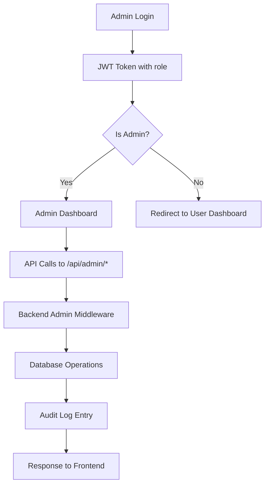
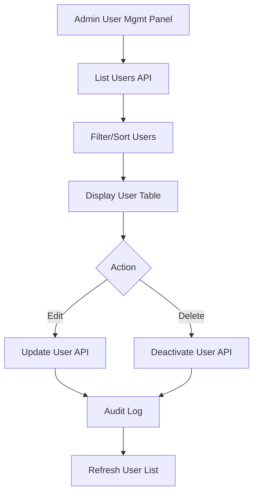

# Admin Dashboard Technical Specification for Medicare System

## Overview
The admin dashboard provides comprehensive management capabilities for the Medicare system, accessible only to users with 'admin' role. It includes modules for user management, doctor management, appointment oversight, hospital/department management, communication monitoring, system settings, reports/analytics, and security/audit logs.

## Backend API Design

### Admin Middleware
Extend existing `authMiddleware.js` with role-based access control:

```javascript
const adminOnly = (req, res, next) => {
  if (req.user.role !== 'admin') {
    return res.status(403).json({ message: 'Access denied. Admin role required.' });
  }
  next();
};
```

### Admin Routes Structure
All admin routes prefixed with `/api/admin/` and protected with `protect` and `adminOnly` middleware.

#### User Management Routes
- `GET /api/admin/users` - List all users with pagination, filtering by role
- `GET /api/admin/users/:id` - Get user details
- `PUT /api/admin/users/:id` - Update user (role, status, etc.)
- `DELETE /api/admin/users/:id` - Deactivate user account
- `POST /api/admin/users/:id/reset-password` - Force password reset

#### Doctor Management Routes
- `GET /api/admin/doctors` - List doctors with verification status
- `PUT /api/admin/doctors/:id/verify` - Verify doctor credentials
- `PUT /api/admin/doctors/:id/suspend` - Suspend doctor account
- `GET /api/admin/doctors/:id/appointments` - View doctor's appointments

#### Appointment Management Routes
- `GET /api/admin/appointments` - List all appointments with filters
- `PUT /api/admin/appointments/:id/status` - Update appointment status
- `DELETE /api/admin/appointments/:id` - Cancel appointment
- `GET /api/admin/appointments/stats` - Appointment statistics

#### System Settings Routes
- `GET /api/admin/settings` - Get current system settings
- `PUT /api/admin/settings` - Update system settings
- `POST /api/admin/settings/backup` - Create system backup

#### Reports Routes
- `GET /api/admin/reports/users` - User registration/activity reports
- `GET /api/admin/reports/appointments` - Appointment reports
- `GET /api/admin/reports/revenue` - Revenue reports
- `GET /api/admin/reports/export` - Export reports to CSV/PDF

#### Audit Logs Routes
- `GET /api/admin/audit-logs` - List audit logs with pagination
- `GET /api/admin/audit-logs/:id` - Get specific audit log entry
- `POST /api/admin/audit-logs/search` - Search audit logs

## Database Schema Updates

### New Models

#### AuditLog Model
```javascript
const auditLogSchema = new mongoose.Schema({
  action: { type: String, required: true }, // e.g., 'USER_CREATED', 'APPOINTMENT_UPDATED'
  user: { type: mongoose.Schema.Types.ObjectId, ref: 'user' },
  admin: { type: mongoose.Schema.Types.ObjectId, ref: 'user', required: true },
  details: { type: mongoose.Schema.Types.Mixed },
  ipAddress: { type: String },
  userAgent: { type: String },
}, { timestamps: true });

auditLogSchema.index({ createdAt: -1 });
```

#### SystemSettings Model
```javascript
const systemSettingsSchema = new mongoose.Schema({
  key: { type: String, required: true, unique: true },
  value: { type: mongoose.Schema.Types.Mixed, required: true },
  description: { type: String },
  category: { type: String, enum: ['general', 'security', 'notifications', 'limits'] },
  updatedBy: { type: mongoose.Schema.Types.ObjectId, ref: 'user' },
}, { timestamps: true });
```

#### Hospital Model (if not exists)
```javascript
const hospitalSchema = new mongoose.Schema({
  name: { type: String, required: true },
  address: { type: String, required: true },
  departments: [{ type: String }],
  contactInfo: {
    phone: { type: String },
    email: { type: String },
  },
  isActive: { type: Boolean, default: true },
}, { timestamps: true });
```

### Schema Updates
- Add `isVerified` field to User model for doctors
- Add `status` field to User model (active, suspended, pending)
- Add `hospital` reference to User model for doctors

## Frontend Component Architecture

### Component Hierarchy
```
AdminDashboard
├── AdminLayout
│   ├── AdminSidebar
│   ├── AdminHeader
│   └── AdminContent
│       ├── OverviewPanel
│       ├── UserManagementPanel
│       ├── DoctorManagementPanel
│       ├── AppointmentManagementPanel
│       ├── HospitalManagementPanel
│       ├── CommunicationMonitorPanel
│       ├── SystemSettingsPanel
│       ├── ReportsPanel
│       └── AuditLogsPanel
```

### Key Components

#### AdminLayout
- Handles admin authentication check
- Provides navigation structure
- Manages responsive design

#### AdminSidebar
- Navigation menu with icons
- Active state management
- Collapsible on mobile

#### Data Tables
Reusable components for listing data:
- Sortable columns
- Pagination
- Search/filter functionality
- Bulk actions

#### Modals
- User/Doctor detail modals
- Confirmation dialogs
- Settings forms

### Authentication Flow
1. User logs in via existing login endpoint
2. JWT token contains role information
3. Frontend checks role on admin route access
4. If not admin, redirect to appropriate dashboard
5. Admin routes protected by role check in AuthContext

## Data Flow Diagrams

### Admin Dashboard Data Flow


### User Management Flow


## Integration Points with Existing System

### Authentication Integration
- Extend AuthContext to include admin role checks
- Add admin route protection in React Router

### Database Integration
- Use existing MongoDB connection
- Add new collections for audit logs and settings
- Update existing user model with admin fields

### API Integration
- Add admin routes to existing Express server
- Integrate with existing middleware
- Use existing error handling patterns

### Frontend Integration
- Add admin routes to existing routing structure
- Integrate with existing UI components (buttons, inputs, etc.)
- Use existing SocketContext if needed for real-time features

## Detailed Feature Module Specifications

### 1. Overview Panel
**Purpose:** Provide high-level system metrics and quick actions.

**Features:**
- User statistics (total, active, by role)
- Appointment statistics (total, pending, completed)
- System health indicators
- Recent activities feed
- Quick action buttons

**API Dependencies:** `/api/admin/stats`

### 2. User Management Panel
**Purpose:** Manage all system users.

**Features:**
- User listing with search/filter
- Role assignment
- Account activation/deactivation
- Bulk operations
- User detail views

**API Dependencies:** `/api/admin/users/*`

### 3. Doctor Management Panel
**Purpose:** Oversee doctor registrations and verifications.

**Features:**
- Doctor verification workflow
- Profile management
- Appointment oversight
- Performance metrics

**API Dependencies:** `/api/admin/doctors/*`

### 4. Appointment Management Panel
**Purpose:** Monitor and manage all appointments.

**Features:**
- Appointment calendar view
- Status updates
- Conflict resolution
- Bulk status changes

**API Dependencies:** `/api/admin/appointments/*`

### 5. Hospital/Department Management Panel
**Purpose:** Manage healthcare facilities and departments.

**Features:**
- Hospital CRUD operations
- Department assignment
- Doctor-hospital associations

**API Dependencies:** `/api/admin/hospitals/*`

### 6. Communication Monitor Panel
**Purpose:** Monitor system communications.

**Features:**
- Chat message overview
- Communication analytics
- Moderation tools

**API Dependencies:** `/api/admin/communications/*`

### 7. System Settings Panel
**Purpose:** Configure system-wide settings.

**Features:**
- General settings (maintenance mode, etc.)
- Security settings
- Notification preferences
- Rate limiting

**API Dependencies:** `/api/admin/settings/*`

### 8. Reports/Analytics Panel
**Purpose:** Generate and view system reports.

**Features:**
- Predefined report templates
- Custom date ranges
- Export functionality
- Data visualization

**API Dependencies:** `/api/admin/reports/*`

### 9. Security/Audit Logs Panel
**Purpose:** Monitor system security and activities.

**Features:**
- Audit log viewer
- Search and filter logs
- Export audit trails
- Security alerts

**API Dependencies:** `/api/admin/audit-logs/*`

## Security Considerations
- All admin routes require JWT authentication and admin role
- Audit logging for all admin actions
- Input validation and sanitization
- Rate limiting on admin endpoints
- Secure password reset mechanisms
- Session management with configurable timeouts

## Performance Considerations
- Pagination for large datasets
- Database indexing on frequently queried fields
- Caching for static settings
- Lazy loading for heavy components
- Optimized queries with population where needed

## Testing Strategy
- Unit tests for admin controllers
- Integration tests for admin routes
- E2E tests for admin dashboard flows
- Security testing for role-based access
- Performance testing for data-heavy operations